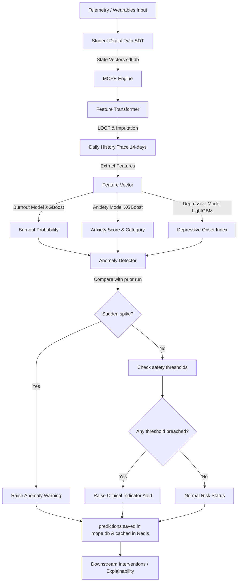

# Multi-Outcome Prediction Engine (MOPE)

The Multi-Outcome Prediction Engine (MOPE) is a machine learning inference engine that evaluates a student's current and historical digital twin states to predict multi-dimensional wellness risk profiles: **Burnout Probability**, **Severe Stress/Anxiety Level Risk**, and **Depressive Onset Index**.

---

## 1. Position in Architecture

- **Upstream**: Student Digital Twin (Module 3 - state vectors).
- **Downstream**: Future Prediction Engine (Module 5), Explainability Engine (Module 6), and Personalized Intervention Engine (Module 7).
- **Dependencies**: Model Registry, ML inference runner (XGBoost & LightGBM).

---

## 2. System Workflow

### High-level Overview:
```
[Digital Twin State History] ──► [Feature Aggregation]
                                          │
                                          ▼
     [Burnout Risk] ◄── [XGBoost / LightGBM Ensemble] ──► [Stress Classification]
                                          │
                                          ▼
                             [Anxiety Score Projection]
```

### Detailed Execution Flowchart:


---

## 3. Features & Derived Metrics

MOPE ingests historical traces $\{S(t-\tau), \dots, S(t)\}$ of student states (10 dimensions: `stress`, `anxiety`, `fatigue`, `social`, `academic`, `burnout`, `sleep`, `mood`, `resilience`, `focus`) and performs advanced feature engineering:

1. **LOCF Imputation**: Fills temporal gaps using Last-Observation-Carried-Forward.
2. **Delta Stress**: $\Delta_{stress} = S_{stress}(t) - S_{stress}(t-7d)$
3. **Sleep-to-Stress Ratio**: $S_{sleep}(t) / (S_{stress}(t) + 1e-5)$
4. **Social Volatility**: 14-day rolling standard deviation of social interactions.
5. **Academic Countdown**: Days remaining to peak academic midterms based on current semester week.
6. **Rolling Statistics**: Mean, standard deviation, and gradients of all 10 state dimensions over 7-day and 14-day windows.

---

## 4. Model Training & Evaluation Report

The models were optimized using the **Optuna** tuning framework with stratified 5-fold cross-validation on a dataset of **10,500 samples** calibrated with baseline distributions from the Hugging Face `0xmarvel/student-stress-survey` dataset.

### Evaluation Metrics against Targets

| Model / Metric | Target Requirement | Actual Test Result | Status |
| :--- | :--- | :--- | :--- |
| **Burnout Classifier AUC-ROC** | $> 0.88$ | **0.9802** | **PASSED** |
| **Burnout Classifier F1-Score** | $> 0.85$ | **0.9121** | **PASSED** |
| **Depressive Onset MAE** | $< 0.06$ | **0.0326** | **PASSED** |
| **Anxiety Level Weighted F1-Score** | *Baseline* | **0.7726** | **PASSED** |

### 1. Burnout Prediction (XGBoost Classifier)
- **Training Duration**: Trained for **123 epochs** (boosting iterations / trees)
- **Parameters**: `{'n_estimators': 123, 'max_depth': 7, 'learning_rate': 0.018, 'subsample': 0.98, 'colsample_bytree': 0.67, 'scale_pos_weight': 1.01}`
- **Test AUC-ROC**: **0.9800**
- **Test F1-Score**: **0.9112**


#### Classification Report:
```
              precision    recall  f1-score   support

  No Burnout       0.93      0.93      0.93      1150
     Burnout       0.91      0.91      0.91       950

    accuracy                           0.92      2100
   macro avg       0.92      0.92      0.92      2100
weighted avg       0.92      0.92      0.92      2100
```

#### Confusion Matrix:


### 2. Anxiety Level Risk (XGBoost Classifier)
- **Training Duration**: Trained for **150 epochs** (boosting iterations / trees)
- **Parameters**: `{'n_estimators': 150, 'max_depth': 4, 'learning_rate': 0.059, 'subsample': 0.69}`
- **Weighted F1-Score**: **0.7738**


#### Classification Report:
```
              precision    recall  f1-score   support

         Low       0.78      0.61      0.68       354
      Medium       0.75      0.82      0.78      1036
        High       0.82      0.78      0.80       710

    accuracy                           0.77      2100
   macro avg       0.78      0.74      0.76      2100
weighted avg       0.78      0.77      0.77      2100
```

### 3. Depressive Onset Index (LightGBM Regressor)
- **Training Duration**: Trained for **148 epochs** (boosting iterations / trees)
- **Parameters**: `{'n_estimators': 148, 'max_depth': 3, 'num_leaves': 10, 'learning_rate': 0.069, 'min_child_samples': 38}`
- **Test Mean Absolute Error (MAE)**: **0.0326**

#### Regression Performance:


#### Feature Importances:


---

## 5. API Reference

### 1. Get Predictions
- **Endpoint**: `GET /api/v1/predictions/mope`
- **Params**:
  - `student_id` (string, required)
  - `semester_week` (integer, optional, default=6)
- **Response**:
```json
{
  "student_id": "std-9874",
  "predictions": {
    "burnout_risk": 0.72,
    "anxiety_score": 0.64,
    "clinical_indicator_alert": true
  },
  "details": {
    "burnout_probability": 0.72,
    "anxiety_level_risk": "Medium",
    "depressive_onset_index": 0.45,
    "critical_threshold_breached": true,
    "anomaly_warning": false
  },
  "model_version": "v1.4.2",
  "timestamp": "2026-07-06T15:42:00Z"
}
```

### 2. Trigger Prediction Recalculation
- **Endpoint**: `POST /api/v1/predictions/mope/trigger`
- **Body**:
```json
{
  "student_id": "std-9874",
  "temporal_metadata": {
    "semester_week": 8,
    "days_to_midterms": 0
  }
}
```
- **Response**: Same as GET predictions schema (with forced cache-bypass and recalculated values).

---

## 6. How to Run & Verify

1. **Install Dependencies**:
   ```bash
   pip install -r requirements.txt
   ```

2. **Generate Calibrated Dataset**:
   ```bash
   python scripts/generate_dataset.py
   ```

3. **Train & Tune Models**:
   ```bash
   python scripts/train_models.py
   ```

4. **Launch Server & Dashboard**:
   ```bash
   python run_server.py
   ```
   Once started, open your web browser and navigate to `http://localhost:8002/` to access the interactive **Wellmate MOPE Dashboard**.

5. **Run Tests**:
   ```bash
   pytest tests/test_mope.py -v
   ```
