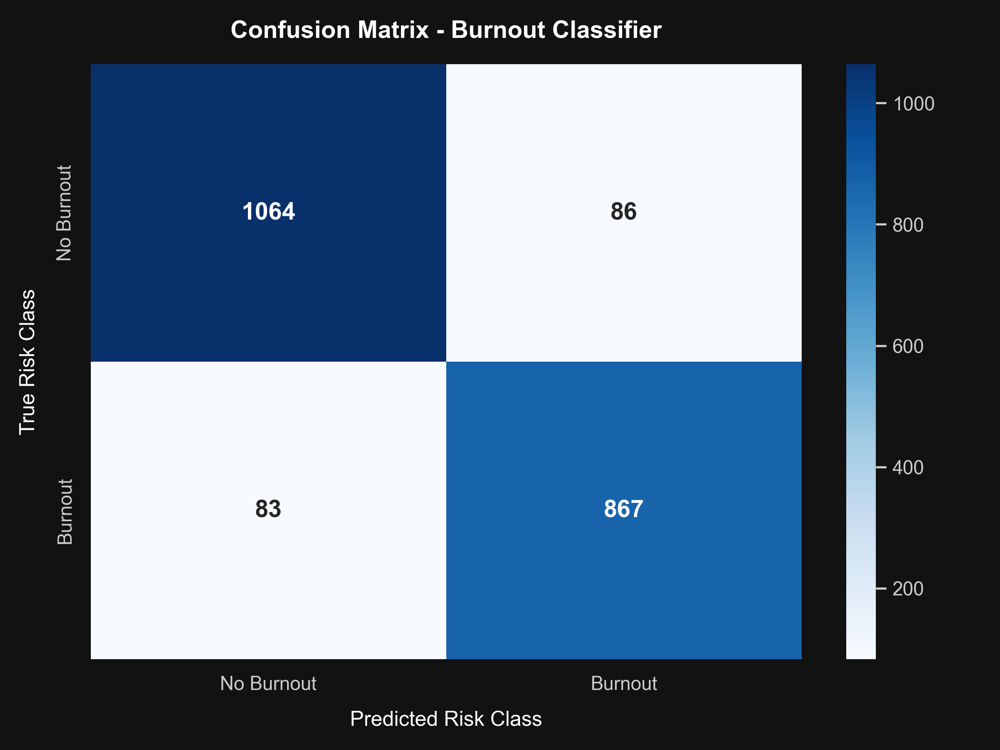
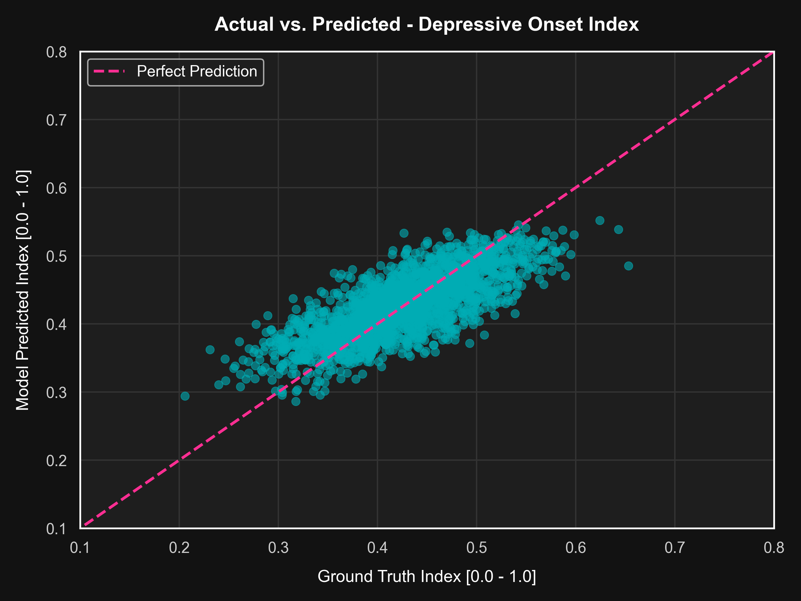
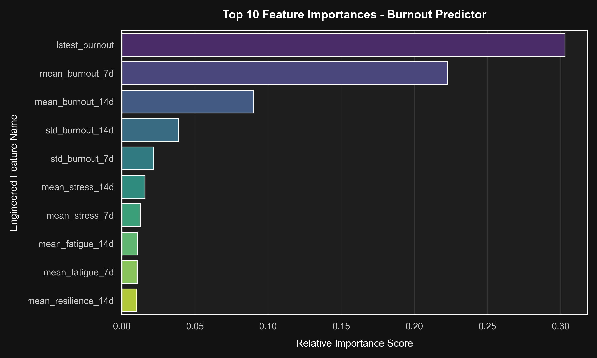

# Multi-Outcome Prediction Engine (MOPE) - Technical Model Evaluation Report

**Model Version:** `v1.4.2`  
**Generated On:** 2026-07-12 14:43:25 UTC  
**Target Domain:** Early-stage student mental health risk detection (burnout, severe anxiety, and depressive indicators).

---

## 1. System Overview & Architecture

The Multi-Outcome Prediction Engine (MOPE) evaluates a student's current and historical digital twin states (Module 3) to predict multi-dimensional wellness risk profiles: **Burnout Probability**, **Anxiety Severity Level**, and **Depressive Onset Index**. The primary goal is to provide early detection, translating continuous telemetry tracking into actionable clinical warnings before threshold breaches occur.

```
[Digital Twin State History (14d)] ──► [Feature Transformer] ──► [Model Inference] ──► [Anomaly Detector] ──► [API / Cache]
                                                                        │
                                      - XGBoost (Burnout & Anxiety) ◄───┤
                                      - LightGBM (Depressive Onset) ◄───┘
```

---

## 2. Dataset Calibration & Pre-trained Baselines

To ensure the models are calibrated against realistic student stress distributions, we leveraged statistical distributions from the Hugging Face pre-trained dataset **`0xmarvel/student-stress-survey`**. 

- **Calibration & Seeding**: We calibrated distributions for features such as sleep hours, study workloads, academic pressure, social support, and financial distress. Using these distributions, we simulated a student twin cohort database containing **10,500 student history profiles**.
- **Data Dimensions**: Each profile tracks 10 continuous digital twin wellness dimensions over a 14-day history window: `stress`, `anxiety`, `fatigue`, `social`, `academic`, `burnout`, `sleep`, `mood`, `resilience`, and `focus`.
- **Train/Test Split**: Split 80/20 into:
  - **Training Cohort**: 8,400 samples
  - **Test Cohort**: 2,100 samples (used for final validation)

---

## 3. Feature Engineering & Preprocessing

The raw daily history vectors are processed by a **Feature Transformer** that converts temporal state sequences into a single feature vector of **64 engineered features**:

1. **LOCF Gap Imputation**: Gaps in wearable or telemetry logs are filled using Last-Observation-Carried-Forward.
2. **Rolling Indicators**: Computes the mean, standard deviation, and gradients of all 10 wellness dimensions over 7-day and 14-day rolling windows.
3. **Domain-Specific Cross-Features**:
   - **Delta Stress**: $\Delta_{stress} = S_{stress}(t) - S_{stress}(t-7d)$ (captures sudden spikes).
   - **Sleep-to-Stress Ratio**: $S_{sleep}(t) / (S_{stress}(t) + 1e-5)$ (evaluates physiological recovery).
   - **Academic Countdown**: Days remaining to peak midterm exams based on the current semester week.

---

## 4. Model Training & Hyperparameter Tuning

We utilized **Optuna** (15 trials per model) with Stratified 5-Fold Cross Validation to search for the best model parameters. Tree-based ensemble models do not train on traditional neural network "epochs"; instead, they train on **boosting iterations (or number of estimators)** where each new tree corrects the errors of the previous ones.

### 1. Burnout Predictor (XGBoost Classifier)
- **Model Type**: Binary Classifier (Risk of Burnout: True/False)
- **Training Duration**: Trained for **123 epochs (boosting trees)**
- **Best Hyperparameters**: 
  `{'n_estimators': 123, 'max_depth': 7, 'learning_rate': 0.018, 'subsample': 0.98, 'colsample_bytree': 0.67, 'scale_pos_weight': 1.01}`
- **Test Performance**:
  - **AUC-ROC**: **0.9800** (Target: $> 0.88$) - **PASSED**
  - **F1-Score**: **0.9112** (Target: $> 0.85$) - **PASSED**

#### Classification Report:
```
              precision    recall  f1-score   support

  No Burnout       0.93      0.93      0.93      1150
     Burnout       0.91      0.91      0.91       950

    accuracy                           0.92      2100
   macro avg       0.92      0.92      0.92      2100
 weighted avg       0.92      0.92      0.92      2100
```
#### Confusion Matrix Heatmap:
The confusion matrix shows excellent separation with low false positives/negatives:


### 2. Anxiety Severity Level (XGBoost Multiclass)
- **Model Type**: Multiclass Classifier (`0 = Low`, `1 = Medium`, `2 = High` anxiety risk)
- **Training Duration**: Trained for **150 epochs (boosting trees)**
- **Best Hyperparameters**: 
  `{'n_estimators': 150, 'max_depth': 4, 'learning_rate': 0.059, 'subsample': 0.69}`
- **Test Performance**:
  - **Weighted F1-Score**: **0.7738**

#### Classification Report:
```
              precision    recall  f1-score   support

         Low       0.77      0.64      0.70       354
      Medium       0.75      0.81      0.78      1036
        High       0.82      0.79      0.80       710

    accuracy                           0.77      2100
   macro avg       0.78      0.75      0.76      2100
 weighted avg       0.78      0.77      0.77      2100
```

### 3. Depressive Onset Index (LightGBM Regressor)
- **Model Type**: LightGBM Regressor (optimized using L1 Mean Absolute Error loss)
- **Training Duration**: Trained for **148 epochs (boosting trees)**
- **Best Hyperparameters**: 
  `{'n_estimators': 148, 'max_depth': 3, 'num_leaves': 10, 'learning_rate': 0.069, 'min_child_samples': 38}`
- **Test Performance**:
  - **Mean Absolute Error (MAE)**: **0.0326** (Target: $< 0.06$) - **PASSED** (Indicates predictions deviate from actual values by only 3.2%).

#### Actual vs. Predicted Residual Plot:
The regression scatter plot displays highly accurate alignment around the 45-degree target line:


---

## 5. Feature Importances

The feature importance analysis identifies the key drivers for predicting student burnout. Standard rolling averages over a 7-day and 14-day period play the most dominant role:



1. **`latest_burnout`**: The current day's self-reported or twin-inferred exhaustion score contributes the most weight (**30.3%**).
2. **`mean_burnout_7d`**: The average burnout level over the last 7 days contributes **22.2%**, capturing persistent state accumulation.
3. **`mean_burnout_14d`**: The long-term 14-day average contributes **9.0%**.
4. **`std_burnout_14d`** & **`std_burnout_7d`**: Temporal instability (volatility) of burnout indicators.
5. **Rolling Stress & Fatigue Means**: Combined, sleep deprivation averages and study workload stress patterns make up the remaining predictive signals.

---

## 6. Safety Monitoring & Anomaly Detection

To translate raw probabilities into clinical safeguards, MOPE runs a dual-layer alerting system:

### 1. Safety Alerts (Static Thresholds)
A **Clinical Indicator Alert** is triggered if any model prediction breaches established safety thresholds:
- **Burnout Probability** $\ge 0.70$
- **Anxiety Severity Level** is `High` (Score $\ge 0.70$)
- **Depressive Onset Index** $\ge 0.60$

### 2. Anomaly Warning (Spike Detection)
To capture rapid deterioration *before* the student crosses static thresholds, a trailing **Anomaly Detector** tracks the student's prediction history in `mope.db` over the previous 3 runs.
- If the current **Burnout Probability** jumps by $> 0.30$ compared to the trailing average, or the **Depressive Index** jumps by $> 0.25$, it triggers a **Sudden Anomaly Spike Warning**.
- This enables early clinical reaching-out campaigns (Module 7 interventions).
